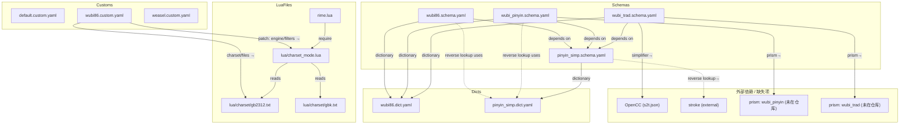

# Lwubi86 依赖关系图

下面的图展示了仓库中主要 schema、dict、custom、lua 与外部依赖之间的关系，便于在 PR/文档中直观展示。

---

---

## 说明
- 虚线（-.->）表示逻辑引用或反查关系；实线（-->）表示文件/资源直接依赖或包含。
- `PRISM_*`、`OPENCC`、`STROKE` 是仓库引用但未在本仓库中发现的外部资源或表，建议在 PR 中标注并决定是否补齐。

## 验证清单（Acceptance）
1. 在 GitHub 上打开 `docs/dependency-mermaid.md`，确认 Mermaid 图能正确渲染且节点/连线与仓库当前状态一致。 
2. 在本地或 mermaid.live 粘贴上面的 mermaid 代码，确认无语法错误且布局清晰。

## 回滚方式
- 若需要回滚：删除分支 `docs/dependency-diagram` 或在合并后用 `git revert` 撤销相应 commit/PR。
